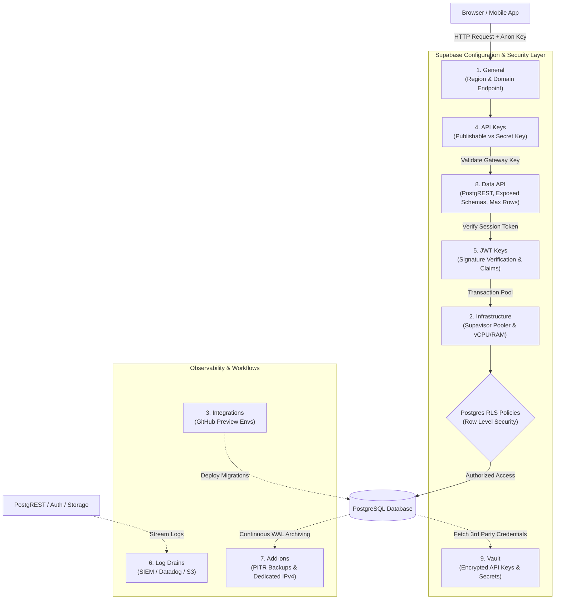

# Supabase Settings & Security Architecture Guide

This guide provides a comprehensive technical breakdown of the 9 core configuration sections in the **Supabase Dashboard > Settings** menu. It explains what each setting controls, key configurations, security implications, and how they fit into the application runtime flow.

---

## Table of Contents
1. [General](#1-general)
2. [Infrastructure](#2-infrastructure)
3. [Integrations](#3-integrations)
4. [API Keys](#4-api-keys)
5. [JWT Keys](#5-jwt-keys)
6. [Log Drains](#6-log-drains)
7. [Add-ons](#7-add-ons)
8. [Data API](#8-data-api)
9. [Vault](#9-vault)
10. [End-to-End Configuration Flow](#10-end-to-end-configuration-flow)

---

## 1. General

### Overview
The **General** section manages project identity, regional placement, state (active, paused, restarting), and organization governance.

### Key Fields & Controls
* **Project Name & Reference ID (`ref`)**: Unique 20-character identifier that forms subdomains:
  * REST API: `https://[ref].supabase.co/rest/v1`
  * Auth: `https://[ref].supabase.co/auth/v1`
  * Storage: `https://[ref].supabase.co/storage/v1`
  * Direct DB: `db.[ref].supabase.co`
* **Region**: AWS cloud region (e.g., `us-east-1`, `eu-central-1`). Immutable post-provisioning.
* **Pausing & State**: Free tier projects auto-pause after 7 days of inactivity. Manual pause saves compute while retaining disk volume snapshots for up to 1 year.
* **Danger Zone**: Project transfer (changing organization ownership) and permanent deletion.

### Security & Architecture Impact
* **Compliance**: Region selection dictates data residency (GDPR, HIPAA). Wrong region selection requires manual SQL dump and restore migrations.
* **Latency**: Selecting a region geographically close to application servers (or edge functions) minimizes TCP setup times and round-trip latency.

---

## 2. Infrastructure

### Overview
Controls underlying compute (vCPU/RAM), storage disk auto-scaling, and connection pooling (Supavisor / PgBouncer).

### Key Fields & Controls
* **Compute Size**: Ranges from Shared Micro (1GB RAM) to 16XL (256GB RAM). Directly affects PostgreSQL parameters (`shared_buffers`, `max_connections`, `work_mem`).
* **Disk Auto-Scaling**: Automatically expands GP3 EBS storage when remaining disk drops below 10–20% (expands by 1.5x up to limits).
* **Connection Pooler (Supavisor)**:
  * *Transaction Mode (Default for Serverless)*: Multiplexes thousands of client requests into a fixed set of Postgres connections. Connections are assigned per transaction.
  * *Session Mode*: Maintains connection state per client; supports temporary tables but limits total client count.
* **Read Replicas**: Provisions read-only PostgreSQL standby instances to offload `SELECT` traffic.

### Security & Architecture Impact
* **Serverless Safety**: Serverless runtimes (Vercel, AWS Lambda) spin up hundreds of transient connections. Without Supavisor transaction pooling, Postgres quickly exhausts `max_connections` (10MB RAM per process), causing Denial of Service (DoS) or Out-Of-Memory (OOM) crashes.
* **Storage Exhaustion**: If disk reaches 100%, Postgres forcibly locks into read-only mode to prevent Write-Ahead Log (WAL) corruption. Auto-scaling prevents unexpected lockouts.

---

## 3. Integrations

### Overview
Manages external developer platform connections, primarily the **GitHub Integration** for Database-as-Code workflows and automated PR preview environments.

### Key Fields & Controls
* **GitHub Repository Connection**: Connects a Git repo to Supabase.
* **Working Directory**: Specifies the path containing `./supabase` (config, migrations, and seeds).
* **Branching & Preview Environments**: Provisions a temporary isolated Supabase DB per Pull Request, runs migrations (`supabase migration up`), and populates seed data (`seed.sql`).

### Security & Architecture Impact
* **PII Protection**: Preview environments create fresh isolated instances and **do not** clone production data, ensuring sensitive production PII is never exposed to development or test environments.
* **Schema Drift**: Automates schema migration via versioned, code-reviewed `.sql` scripts instead of manual SQL editor modifications.

---

## 4. API Keys

### Overview
Manages authentication credentials for the Supabase API Gateway (Kong/Envoy) and PostgREST.

### Key Fields & Controls
* **Publishable Key (Legacy `anon` key)**:
  * *Role*: Maps to the `anon` PostgreSQL role.
  * *Visibility*: **Public**. Included in browser JavaScript and mobile app bundles.
  * *Authorization*: Requests using this key are **strictly restricted by Row Level Security (RLS)**.
* **Secret Key (Legacy `service_role` key)**:
  * *Role*: Maps to the `service_role` PostgreSQL role.
  * *Visibility*: **Private/Confidential**. Must NEVER be exposed in client code.
  * *Authorization*: **BYPASSES ALL RLS POLICIES**. Full administrative access to read, write, and delete all data.

### Security & Architecture Impact
* **Least Privilege**: Client applications must exclusively use the Publishable/`anon` key.
* **Catastrophic Exposure Risk**: Leaking the `service_role` key in frontend code gives attackers complete administrative access to the entire database, bypassing every security rule.

---

## 5. JWT Keys

### Overview
Manages cryptographic keys used by Supabase Auth (GoTrue) to sign JSON Web Tokens (JWTs) and verified by PostgREST, Storage, and Realtime services.

### Key Fields & Controls
* **JWT Secret (HMAC-SHA256)**: Shared secret key for signing and verifying tokens.
* **Asymmetric Keys (RS256 / ES256)**: Auth server signs using a private key; API services verify using a public key.
* **Token Expiry (`exp`)**: Sets the access token lifespan (default: 3600s / 1 hour).
* **Custom Claims**: Tokens must contain `sub` (User UUID), `role` (`authenticated`, `anon`, `service_role`), and `exp`.

### Security & Architecture Impact
* **Token Forgery**: If the symmetric JWT secret leaks, an attacker can sign valid custom tokens with `role: service_role` or `role: postgres`, completely bypassing authentication.
* **Key Rotation**: Rotating the JWT secret immediately invalidates all active user sessions across all clients—a critical step during incident response.

---

## 6. Log Drains

### Overview
Streams structured real-time system, API, and database logs from Logflare to external SIEM, APM, or cloud storage destinations.

### Key Fields & Controls
* **Sources**: Postgres query logs, PostgREST HTTP logs, GoTrue Auth logs, Storage logs, Edge Functions logs, Supavisor logs.
* **Destinations**: Datadog, Axiom, Amazon S3, Grafana Loki, Sentry, OpenTelemetry (OTLP), or Custom HTTP endpoints (Splunk, Vector, Elastic).

### Security & Architecture Impact
* **Compliance & Auditing**: Regulations (SOC 2, HIPAA, PCI-DSS) require tamper-proof, long-term log retention. Log drains bypass the short retention limits of the default dashboard.
* **Threat Detection**: Real-time streaming enables automated alerts for brute-force logins, authorization spikes (401/403 errors), or abnormal query traffic.

---

## 7. Add-ons

### Overview
Opt-in platform extensions billed on a usage basis.

### Key Fields & Controls
* **Compute Upgrades**: Scaling instance sizes (Micro to 16XL).
* **Point-In-Time Recovery (PITR)**: Streams WAL logs to backup storage, enabling point-in-time database restoration to any second within 7, 14, or 28 days.
* **Dedicated IPv4 Address**: Static IPv4 address for network firewall rules.
* **Custom Domains**: Serve API and Auth endpoints under your own domain (e.g., `api.vaultshare.com`).

### Security & Architecture Impact
* **Disaster Recovery**: Reduces Recovery Point Objective (RPO) from 24 hours (daily backups) to seconds, protecting against accidental drops or data corruption.
* **Cookie Isolation**: Custom domains eliminate third-party cookie restrictions in modern browsers (Safari ITP) by keeping Auth cookies on the apex domain.

---

## 8. Data API

### Overview
Configures **PostgREST**, which auto-generates RESTful HTTP APIs directly from PostgreSQL database schemas.

### Key Fields & Controls
* **Exposed Schemas**: Schemas available over HTTP (default: `public`, `storage`, `graphql_public`).
* **Extra Search Path**: Schemas appended to `search_path` during execution.
* **Max Rows (`max_rows`)**: Caps the maximum number of rows returned in a single HTTP response (e.g., 1000).
* **Connection Pool Size**: Dedicated Postgres connections allocated to PostgREST.

### Security & Architecture Impact
* **DoS Circuit Breaker**: `max_rows` prevents unoptimized or malicious queries (e.g., `GET /rest/v1/documents?select=*`) from exhausting server memory.
* **Schema Encapsulation**: Keeping sensitive internal schemas (e.g., `private`, `auth`, `vault`) out of the exposed list ensures they cannot be queried over HTTP.
* **RLS Mandatory**: Every exposed schema table is reachable via HTTP; RLS must be enabled to prevent unauthorized data access.

---

## 9. Vault

### Overview
An extension (`vault`) built on **pgsodium** providing transparent, authenticated application-level encryption and secrets management directly within PostgreSQL.

### Key Fields & Controls
* **Storage (`vault.secrets`)**: Encrypted table storing secret names, values, descriptions, and key IDs.
* **Encryption (pgsodium AEAD)**: Uses libsodium Authenticated Encryption with Associated Data before saving to disk.
* **SQL Helpers**:
  * `vault.create_secret(secret_value, secret_name, description)`
  * `vault.decrypted_secrets` (secure SQL view decrypting secrets on-the-fly for authorized roles).

### Security & Architecture Impact
* **Zero Hardcoded Secrets**: Prevents API keys (Stripe, OpenAI, SendGrid) from being committed in SQL migrations or Git repositories.
* **Zero-Trust Encryption**: Secret values remain encrypted even if a raw database dump or backup file is compromised.

---

## 10. End-to-End Configuration Flow

The following diagram illustrates how these 9 settings sections interact during an application request:

